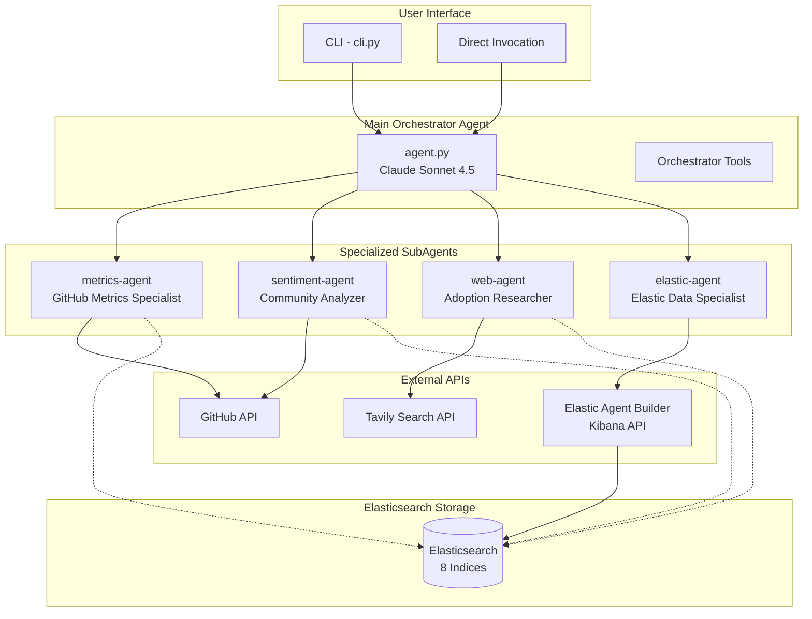
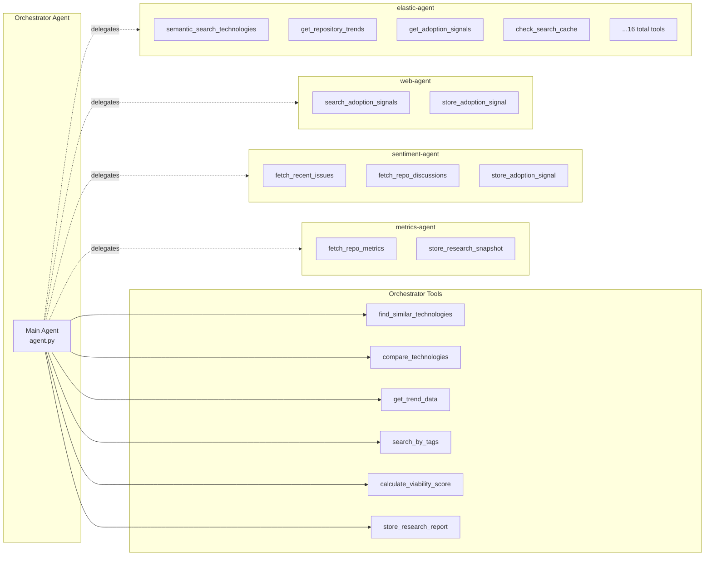
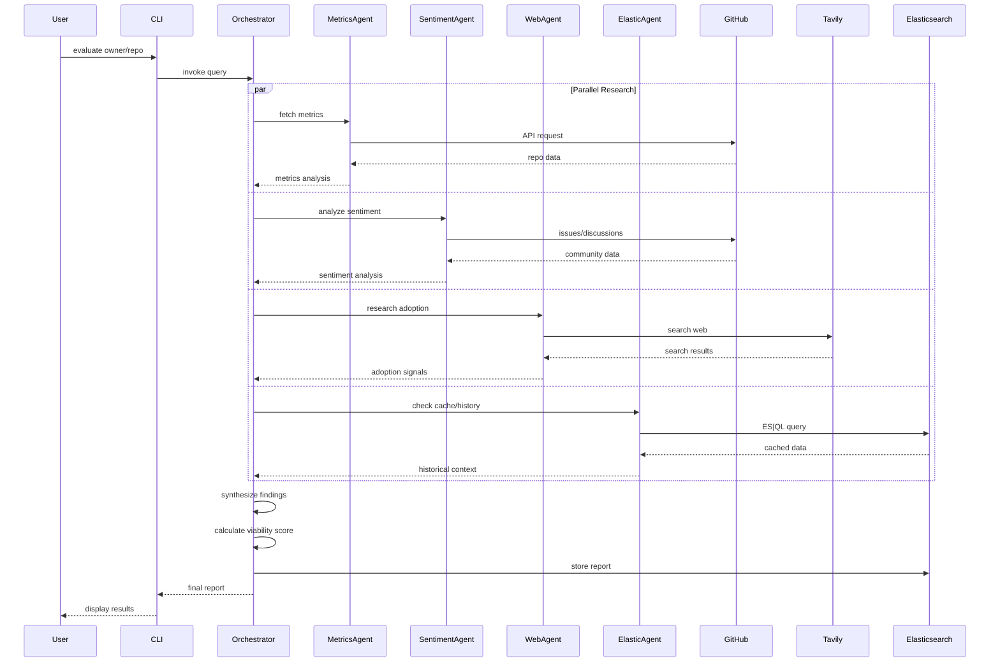
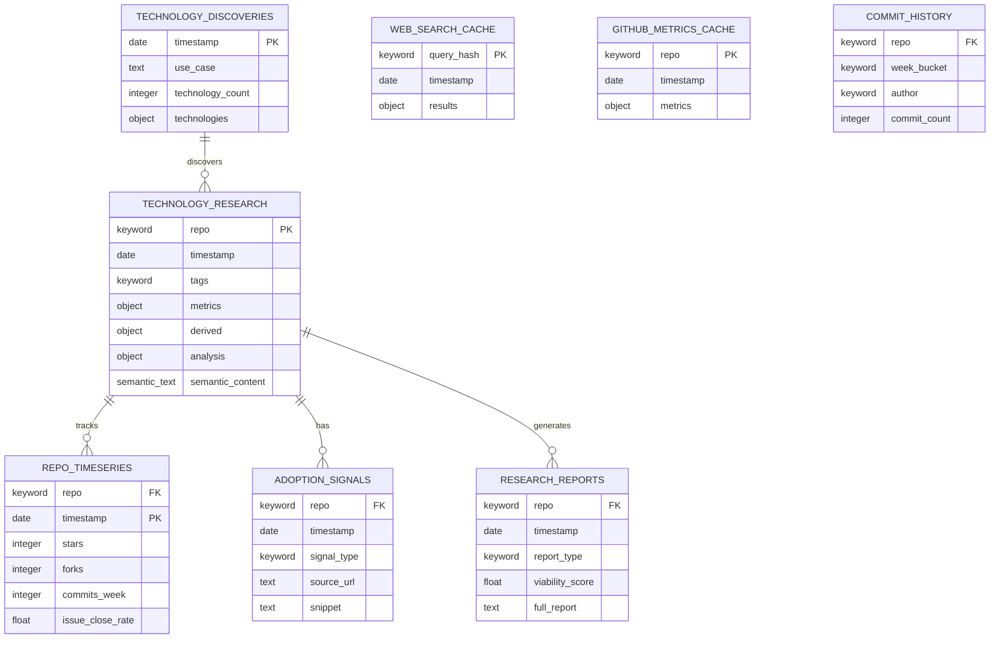

# DevRel Research Agent

A multi-agent research system built on LangChain's **DeepAgents** framework that helps Developer Advocates evaluate technologies, track framework health, and identify emerging tools worth covering.

## Features

- **Multi-Agent Architecture**: Orchestrator delegates to specialized subagents for parallel research
- **GitHub Health Tracking**: Stars, commits, contributor activity, issue trends
- **Community Sentiment Analysis**: Issues, discussions, maintainer responsiveness
- **Real-world Adoption Research**: Blog posts, case studies, job postings, conference talks
- **Elastic Agent Integration**: ES|QL queries via Elastic serverless agent for all data operations
- **Semantic Search**: Find similar technologies using vector embeddings
- **Viability Scoring**: Weighted scores with actionable recommendations
- **Historical Tracking**: Time-series data for trend analysis

---

## Architecture Overview



---

## DeepAgents Framework

This project uses LangChain's **DeepAgents** framework for building hierarchical multi-agent systems.

### What is DeepAgents?

DeepAgents provides a clean abstraction for creating agents that can:
- Delegate tasks to specialized subagents
- Run subagents in parallel for efficiency
- Share context and tools across the agent hierarchy
- Maintain conversation state across interactions

### Agent Creation Pattern

```python
from deepagents import create_deep_agent

agent = create_deep_agent(
    model="anthropic:claude-sonnet-4-5-20250929",
    system_prompt=system_prompt,
    tools=[...],           # Tools available to this agent
    subagents=[...],       # Subagents this agent can delegate to
)
```

### Subagent Definition

Subagents are defined as dictionaries with:

```python
subagent = {
    "name": "agent-name",           # Unique identifier
    "description": "...",           # When to use this agent
    "system_prompt": "...",         # Agent's instructions
    "tools": [tool1, tool2, ...],   # Available tools
}
```

---

## Agent Hierarchy



---

## Component Details

### 1. Main Orchestrator (`agent.py`)

The central coordinator that:
- Receives user queries (evaluate, compare, discover)
- Delegates to appropriate subagents in parallel
- Synthesizes findings into a final report
- Calculates viability scores
- Stores results to Elasticsearch

**Model**: Claude Sonnet 4.5

### 2. Metrics Agent (`subagents/metrics_agent.py`)

Specializes in quantitative GitHub analysis:

| Metric Type | Examples |
|-------------|----------|
| Raw Metrics | Stars, forks, contributors, issues, PRs |
| Derived | Commit velocity, issue close rate, PR merge rate |
| Temporal | Commits per 7d/30d/90d, star growth rate |

**Tools**: `fetch_repo_metrics`, `store_research_snapshot`

### 3. Sentiment Agent (`subagents/sentiment_agent.py`)

Analyzes community health through:
- Recent issue content and tone
- Discussion topics and engagement
- Maintainer responsiveness patterns
- Community support quality

**Tools**: `fetch_recent_issues`, `fetch_repo_discussions`, `store_adoption_signal`

### 4. Web Agent (`subagents/web_agent.py`)

Researches real-world adoption:
- Blog posts and tutorials
- Case studies and production usage
- Conference talks and presentations
- Job postings mentioning the technology

**Tools**: `search_adoption_signals`, `store_adoption_signal`

### 5. Elastic Agent (`subagents/elastic_agent.py`)

Interfaces with Elasticsearch via the **Elastic Agent Builder**:

| Capability | Tools |
|------------|-------|
| Semantic Search | `semantic_search_technologies` |
| Trend Analysis | `get_repository_trends`, `get_repository_timeseries`, `get_repository_stats` |
| Adoption Signals | `get_adoption_signals`, `get_adoption_signals_by_type`, `count_adoption_signals` |
| Caching | `check_search_cache`, `check_github_metrics_cache` |
| Reports | `get_latest_research_report`, `get_cached_research_report` |
| Discoveries | `get_past_discoveries`, `search_discoveries_by_use_case`, `get_all_discovered_repositories` |

**Integration**: Uses ES|QL queries executed through Kibana Agent Builder API

---

## Data Flow



---

## Elasticsearch Indices



| Index | Purpose | TTL |
|-------|---------|-----|
| `technology-research` | Main research snapshots with embeddings | Permanent |
| `repo-timeseries` | Point-in-time metrics for trend graphs | Permanent |
| `adoption-signals` | Blog posts, case studies, job postings | Permanent |
| `research-reports` | Final evaluation/comparison reports | Permanent |
| `technology-discoveries` | Discovered technologies by use case | Permanent |
| `web-search-cache` | Cached Tavily search results | 7 days |
| `github-metrics-cache` | Cached GitHub API responses | 24 hours |
| `commit-history` | Weekly commit aggregates by author | Permanent |

---

## Project Structure

```
DeepDevRel/
├── agent.py                      # Main orchestrator agent
├── cli.py                        # Command-line interface
├── config.py                     # Configuration management
├── prompts.py                    # System prompts
├── exceptions.py                 # Custom exceptions
├── requirements.txt              # Python dependencies
│
├── subagents/                    # Specialized subagents
│   ├── __init__.py
│   ├── metrics_agent.py          # GitHub metrics specialist
│   ├── sentiment_agent.py        # Community sentiment analyzer
│   ├── web_agent.py              # Adoption researcher
│   └── elastic_agent.py          # Elastic data specialist
│
├── tools/                        # Agent tools
│   ├── __init__.py
│   ├── github_tools.py           # GitHub API interactions
│   ├── elasticsearch_tools.py    # Direct ES operations
│   ├── elastic_agent_client.py   # Kibana Agent Builder client
│   ├── elastic_subagent_tools.py # ES|QL tool wrappers (16 tools)
│   └── scoring_tools.py          # Viability scoring logic
│
├── utils/                        # Utilities
│   ├── logging_utils.py          # Logging setup
│   └── retry_utils.py            # Retry logic
│
├── scripts/                      # Setup and testing
│   ├── setup_elasticsearch.py    # ES index creation
│   ├── test_agent.py             # Agent testing
│   └── test_elastic_agent_tools.py # ES|QL tools test suite
│
├── elastic_agent_tools.md        # ES|QL tool definitions for Dev Tools
├── research_reports/             # Generated markdown reports
└── CLAUDE.md                     # Claude Code instructions
```

---

## Installation

### 1. Install dependencies

```bash
pip install -r requirements.txt
```

### 2. Configure environment variables

Create a `.env` file:

```bash
# LLM Provider
ANTHROPIC_API_KEY=your_key

# Web Search
TAVILY_API_KEY=your_key

# GitHub
GITHUB_API_KEY=your_token

# Elasticsearch
ELASTICSEARCH_HOST=https://your-cluster.es.cloud.com
ELASTICSEARCH_API_KEY=your_base64_encoded_key

# Kibana (for Elastic Agent Builder)
KIBANA_URL=https://your-cluster.kb.cloud.com
# KIBANA_API_KEY=optional_if_same_as_es_key

# Observability (optional)
LANGSMITH_API_KEY=your_key
LANGCHAIN_PROJECT=devrel-research-agent
```

### 3. Setup Elasticsearch indices

```bash
python scripts/setup_elasticsearch.py
```

### 4. Create ES|QL tools in Kibana Dev Tools

Copy commands from `elastic_agent_tools.md` into Kibana Dev Tools to create the 16 ES|QL tools in the Agent Builder.

---

## Usage

### CLI Commands

**Discover technologies for a use case:**
```bash
python cli.py discover "UI frameworks for multi-modal AI chat"
python cli.py discover "real-time collaboration libraries" --limit 5
```

**Evaluate a repository:**
```bash
python cli.py evaluate langchain-ai/langgraph
python cli.py evaluate langchain-ai/langgraph --use-case "building research agents"
```

**Compare repositories:**
```bash
python cli.py compare crewAIInc/crewAI microsoft/autogen --use-case "multi-agent orchestration"
```

**Search researched technologies:**
```bash
python cli.py search "AI agent frameworks" --tags ai-agents python
```

**Export results:**
```bash
python cli.py evaluate owner/repo --output report.md --format markdown
python cli.py evaluate owner/repo --output report.json --format json
```

### Direct Python Invocation

```python
from agent import agent

result = agent.invoke({
    "messages": [{
        "role": "user",
        "content": "Evaluate langchain-ai/langgraph for building DevRel research automation"
    }]
})

print(result["messages"][-1].content)
```

### Run Tests

```bash
# Test the main agent
python scripts/test_agent.py

# Test ES|QL tools
python scripts/test_elastic_agent_tools.py
python scripts/test_elastic_agent_tools.py --list
python scripts/test_elastic_agent_tools.py --tool find-similar-technologies
```

---

## Viability Scoring

The agent calculates a weighted viability score (0-100):

| Component | Weight | Factors |
|-----------|--------|---------|
| Health Score | 30% | Commit velocity, release frequency, issue close rate |
| Community Score | 25% | Contributors, stars growth, maintainer responsiveness |
| Adoption Score | 25% | Blog posts, case studies, job postings |
| Sentiment Score | 20% | Issue tone, discussion quality, support helpfulness |

### Score Interpretation

| Range | Recommendation |
|-------|----------------|
| 80-100 | **Strong Recommend** - Production-ready, active community |
| 60-79 | **Recommend with Caveats** - Good but watch specific areas |
| 40-59 | **Cautious** - Evaluate alternatives, monitor closely |
| 0-39 | **Avoid** - High risk, consider other options |

---

## Development Status

- [x] Phase 1: Project structure and dependencies
- [x] Phase 2: Core tools (GitHub, Elasticsearch, Scoring)
- [x] Phase 3: SubAgents (Metrics, Sentiment, Web)
- [x] Phase 4: Main orchestrator agent
- [x] Phase 5: Elasticsearch index setup
- [x] Phase 6: Testing and CLI interface
- [x] Phase 7: Documentation and export formats
- [x] Phase 8: Elastic Agent integration with ES|QL tools

### Planned Features

- [ ] Batch evaluation mode
- [ ] Incremental updates (only fetch changed data)
- [ ] Alert system for viability score changes
- [ ] Scheduled research runs
- [ ] Slack/email notifications
- [ ] Dashboard visualizations

---

## License

MIT
